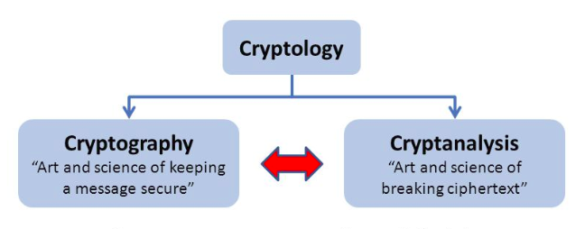

## Cryptology

Cryptology is the science concerned with data communication and storage in secure and usually secret form. 

As shown in the figure above, it encompasses both cryptography and cryptanalysis.

> Cryptology is sometime used synonymously with Cryptography

## Cryptography

Cryptography is the practice and study of techniques for secure communication in the presence of third parties called adversaries.

More generally, cryptography is about constructing and analyzing protocols that prevent third parties or the public from reading private messages.

Cryptography helps us implement information security functions such as data confidentiality, data integrity, authentication, and non-repudiation.

> Cryptography is sometime used synonymously with Cryptology.

## Cryptoanalysis

Cryptanalysis is the science or sometimes the art of breaking a cryptographic scheme.

The goal of cryptanalysis is to find some weakness or insecurity in a cryptographic scheme, thus permitting its subversion or evasion.

## Cryptography vs Cryptoanalysis

| Cryptography | Cryptoanalysis |
|:--:|:--:|
| Hiding messages by converting them into ciphertext | decrypting or obtaining plain text |
| Done in order to transmit a message over insecure channels | Done for checking the robustness of Cryptography |
| Divided into Symmetric, Asymmetric and Hashing  | Divided into Brute Force and Analytical Cryptoanalysis |

